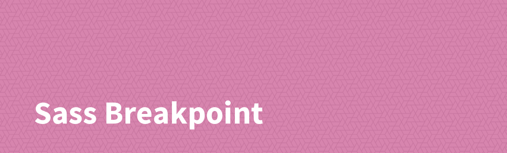

[](https://www.npmjs.com/package/@sass-collective/breakpoint)
[](https://www.npmjs.com/package/@sass-collective/breakpoint)
[](https://david-dm.org/sass-collective/sass-collective?path=packages/breakpoint)
[](https://flat.badgen.net/github/license/sass-collective/sass-collective)

## Introduction

Create easily CSS breakpoint rules.

## Installation

```shell
npm install @sass-collective/breakpoint
```

## Usage

```scss
@use "@sass-collective/breakpoint";

.foo {
    // default min-width
    @include breakpoint.styles(960) {
        font-size: 10px;
    }

    // max-width
    @include breakpoint.styles($max-width: 960) {
        font-size: 10px;
    }

    // min-width & max-width
    @include breakpoint.styles(480, 960) {
        font-size: 10px;
    }

    // root selector
    @include breakpoint.styles(480, $root-selector: ".bar") {
        font-size: 10px;
    }
}
```

### Result

```css
/* default min-width */
@media all and (min-width: 960px) {
    .foo {
        font-size: 10px;
    }
}

/* max-width */
@media all and (max-width: 959px) {
    .foo {
        font-size: 10px;
    }
}

/* min-width & max-width */
@media all and (min-width: 480px) and (max-width: 959px) {
    .foo {
        font-size: 10px;
    }
}

/* root selector */
@media all and (min-width: 480px) {
    .bar .foo {
        font-size: 10px;
    }
}
```

> **NOTE:** you can use the legacy `@import` with dedicated prefix, ex. `sass-breakpoint-styles()`.

### Custom configuration

```scss
@use "@sass-collective/breakpoint" with (
    $large: 1024
);
```

## API

### Options

| Variable | Default | Description |
| --- | --- | --- |
| `$strict` | `true` | Subtract `1px` on `max-width` value, `960px` come `959px` |
| `$very-small` | `320` | iPhone in portrait mode |
| `$small` | `480` | iPhone in landscape mode |
| `$medium` | `768` | iPad in portrait mode |
| `$large` | `960` | Desktop |
| `$wide` | `1200` | Wide screen |

### Mixins

| Mixin | Description |
| --- | --- |
| `styles($min-width, $max-width, $root-selector)` | Create breakpoint rule. |
