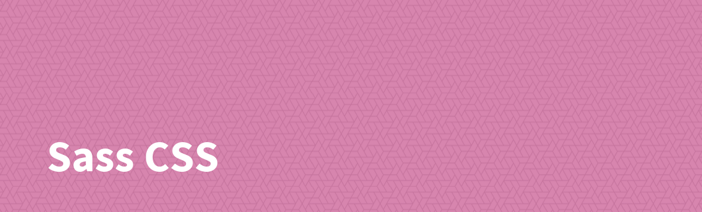

[](https://www.npmjs.com/package/@sass-collective/css)
[](https://www.npmjs.com/package/@sass-collective/css)
[](https://www.npmjs.com/package/@sass-collective/css)

## Introduction

Generate CSS declaration.

## Installation

```shell
npm install @sass-collective/css
```

## Usage

```scss
@use "@sass-collective/css";

.foo {
    @include css.declaration(color, darkcyan);
    // color: darkcyan;
    @include css.declaration(box-shadow, (0 0 10px 5px rgba(darkcyan, 0.75), inset 0 0 10px 5px rgba(darkcyan, 0.75)));
    // box-shadow: 0 0 10px 5px rgba(darkcyan, 0.75), inset 0 0 10px 5px rgba(darkcyan, 0.75);
    // Use parentheses for declare comma separated values list.
    @include css.declaration(color, darkcyan, true);
    // color: darkcyan !important;
}
```

## API

### Mixins

| Mixin | Description |
| --- | --- |
| `declaration($property, $value, $important)` | Generate CSS declaration, with optional `!important`. |
